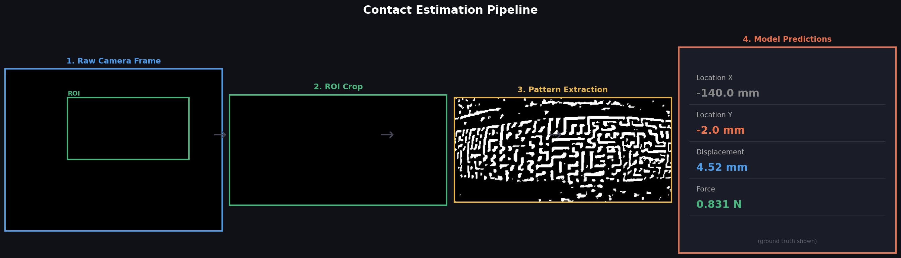
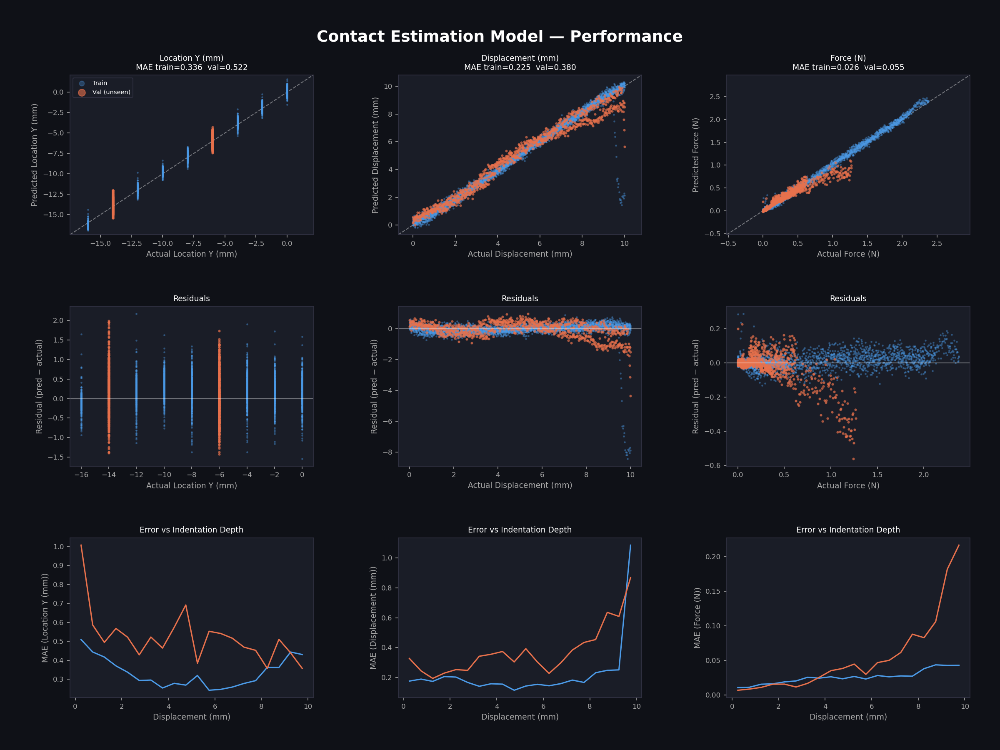

# Optical Tactile Sensing Research

Camera-based tactile sensing system for underwater swimmer skin — predicts contraction and measures indentation displacement using optical flow and load cell data.

---

## Modules

### `dataset/` — Synchronized Data Collection Pipeline

Hardware: USB camera (640×480) + SparkFun NAU7802 Qwiic load cell via Arduino.

**Scripts:**

| Script | Description |
|---|---|
| `record.py` | Master recording script — runs camera and load cell simultaneously |
| `capture.py` | Standalone camera-only capture |
| `load_cell_stream.py` | Live force plot (0–2 N) from load cell |

**`record.py` workflow:**
1. Connects to camera and load cell on startup
2. Computes a Python-side force baseline from first 20 samples (auto-tare)
3. Waits for force > 0.05 N to detect skin contact
4. On contact: sets `time = 0`, `displacement = 0`, `force = 0` (relative)
5. Records camera at 30 fps + force at 40 Hz simultaneously
6. Calculates displacement as `time_s × (10 mm/min ÷ 60)` — system moves at 10 mm/min
7. Hard stops at 10 mm indentation (60 seconds)
8. Saves matched `video_<stamp>.mp4` + `data_<stamp>.csv`

**CSV format (`data_<stamp>.csv`):**
```
time_s, displacement_mm, frame, force_n
0.000,  0.0000,          0,     0.000
0.033,  0.0056,          1,     0.012
...
60.000, 10.0000,         1800,  0.847
```

**Arduino (`loadCellCode.ino`):**
- NAU7802 load cell at 40 SPS
- Calibration factor: 1041.5
- Outputs: `timestamp_us, raw, weight_g, force_n` over serial at 115200 baud

---

### `contraction_prediction/` — Skin Contraction Prediction

Predicts skin contraction state from camera frames using a trained CNN.

- `capture.py` — records video from tactile sensor camera
- `train_model.py` — trains contraction classifier on labeled frames
- `skin_test/` — raw recordings and labeled datasets

---

### `contact_estimation/` — Contact Location, Force & Displacement Estimation

Multi-output ResNet18 model trained on extracted skin pattern images to estimate three contact properties simultaneously in real time.

**Pipeline:**



**Model:**
- **Input**: Extracted binary dot-pattern image (224×224) from the tactile sensor ROI
- **Backbone**: ResNet18 pretrained on ImageNet, fine-tuned with differential learning rates
- **Head**: Dropout(0.4) → Linear(512→128) → ReLU → Linear(128→4)
- **Outputs**: Contact Y-location (mm), Indentation displacement (mm), Contact force (N)
- **Loss**: L1 (MAE) on normalized outputs
- **Validation**: Session-level holdout — y = −6 mm and y = −14 mm held out entirely (unseen during training)

**Performance (val MAE on unseen sessions):**

| Output | Train MAE | Val MAE (unseen locations) |
|---|---|---|
| Location Y | 0.34 mm | 0.52 mm |
| Displacement | 0.23 mm | 0.38 mm |
| Force | 0.026 N | 0.055 N |



*Top row: predicted vs actual. Middle: residuals. Bottom: error as a function of indentation depth.*

**Scripts:**

| Script | Description |
|---|---|
| `build_dataset.py` | Aggregates all recorded sessions into a unified CSV |
| `train_model.py` | Trains the ResNet18 regression model |
| `live_predict.py` | Real-time inference from live camera feed |
| `visualize.py` | Generates performance plots and pipeline diagram |

**Dataset:** 9 sessions × ~453 frames each = 4,074 total frames. Each session is a full 0–10 mm indentation at a fixed y-position (0, −2, −4, −6, −8, −10, −12, −14, −16 mm).

---

### `preprocessing/` — Live Pattern Extraction

- `live_extraction.py` — Side-by-side preview of raw camera + extracted dot pattern. Press **S** to interactively select ROI, **R** to record, **Q** to quit.

---

### `displacement_test/` — Displacement Prediction

Predicts indentation displacement (mm) from camera frames using optical features.

- `train_model.py` — trains displacement regressor
- `assets/` — overlay video showing predicted vs actual displacement

[▶ Watch: Predicted vs Actual Displacement (1:19–1:39)](displacement_test/assets/overlay_1m19s_to_1m39s.mp4)

---

## Hardware

| Component | Details |
|---|---|
| Camera | USB, 640×480, ~7.5–30 fps |
| Load cell | SparkFun NAU7802 Qwiic Scale |
| MCU | Arduino (RedBoard Qwiic) |
| Serial | 115200 baud, `/dev/tty.usbmodem*` |

## Dependencies

```bash
pip install opencv-python pyserial matplotlib
```
