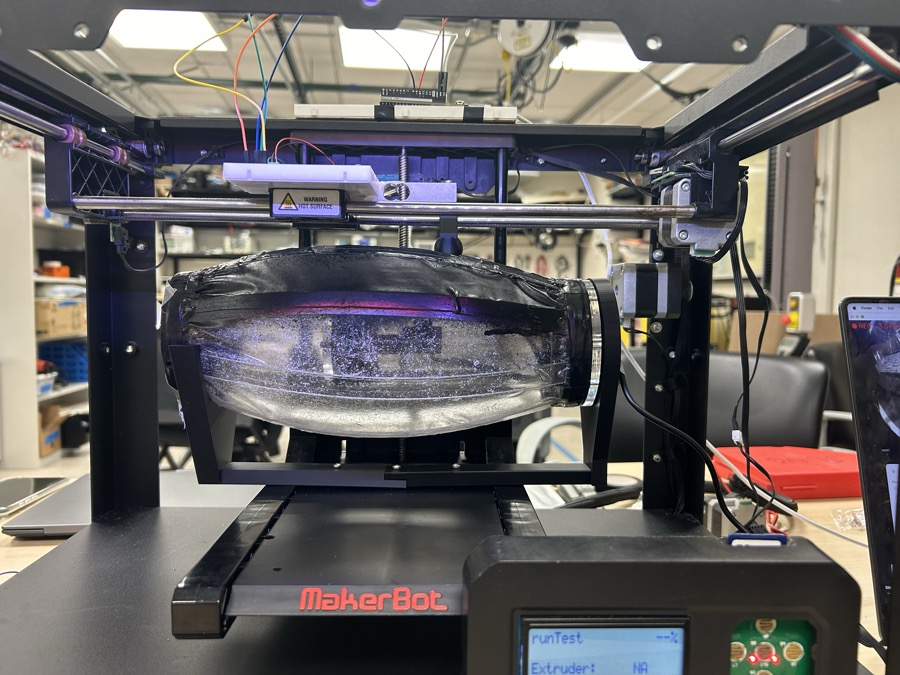
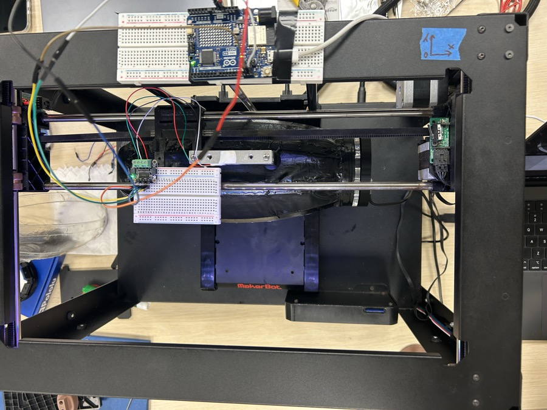
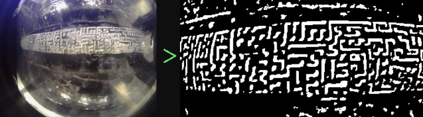
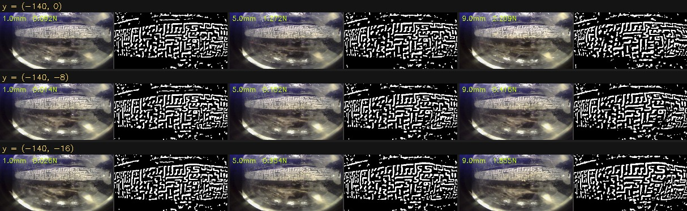
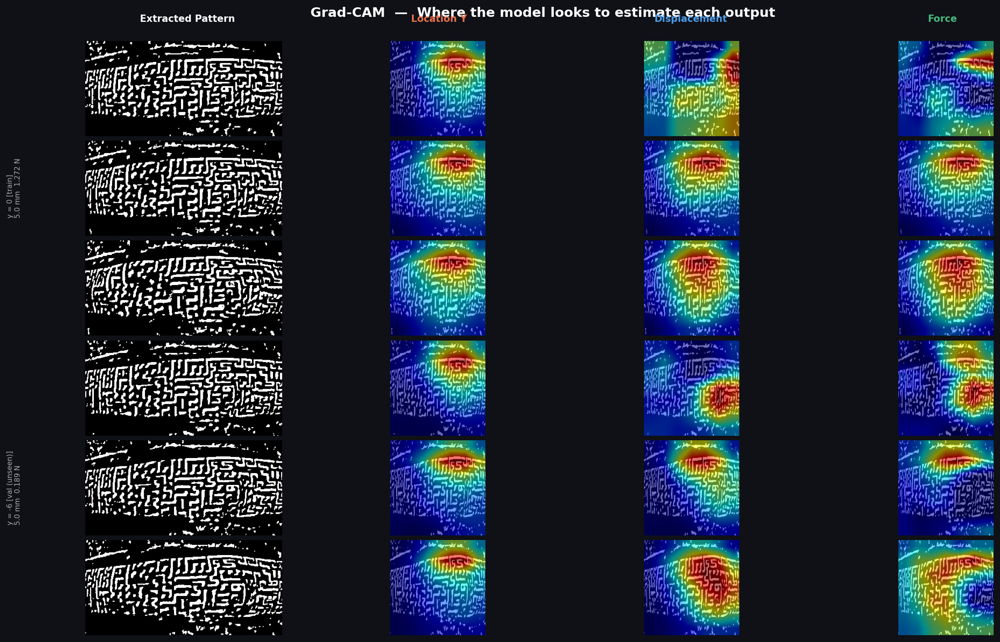
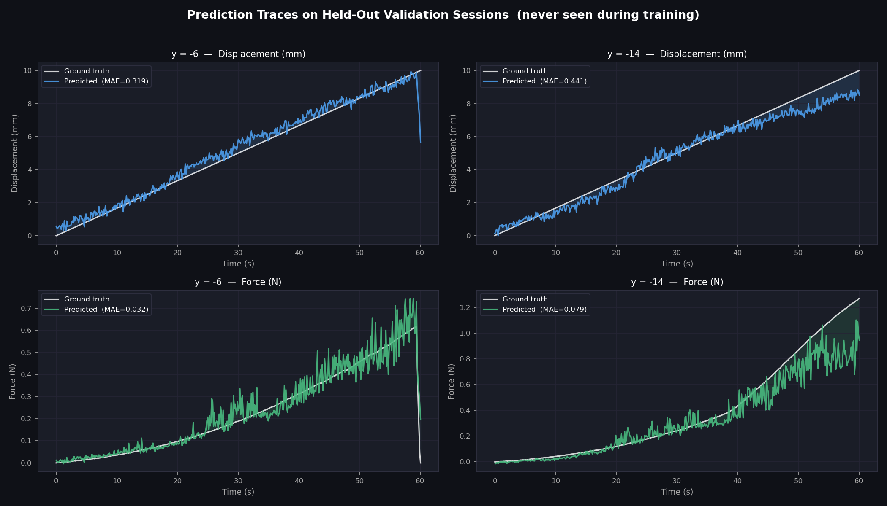

# Optical Tactile Sensing Research

A camera-based tactile sensing system that estimates **contact location, indentation depth, and contact force** from visual deformation of a patterned elastomer skin — using only a USB camera and a load cell for ground truth.

---

## Hardware Setup

The system uses a **MakerBot 3D printer repurposed as a precision linear actuator** to indent a patterned tactile skin at controlled speed (10 mm/min) while recording synchronized camera and force data.

| | |
|---|---|
|  |  |
| *Front: tactile skin mounted in the actuator frame* | *Top: Arduino + NAU7802 load cell breakout* |

| Component | Details |
|---|---|
| Actuator | MakerBot 3D printer (repurposed linear stage) |
| Camera | USB 640×480 @ 30 fps, mounted looking at the skin underside |
| Load cell | SparkFun NAU7802 Qwiic Scale @ 40 SPS |
| MCU | Arduino (RedBoard Qwiic) — serial at 115200 baud |
| Skin | Patterned elastomer with printed dot array |

---

## Step 1 — The Tactile Skin Pattern

The skin is a transparent elastomer with a **printed array of dots** on its surface. When an object contacts the skin, the dots deform — shifting, compressing, and spreading in a way that encodes the contact geometry and force.

The camera is mounted looking up at the underside of the skin through the transparent body, capturing the full dot field during indentation.

---

## Step 2 — Pattern Extraction

Raw camera frames contain lighting variation, reflections, and background clutter. A preprocessing pipeline isolates the dot pattern:

1. **CLAHE** — adaptive histogram equalization to normalize local contrast
2. **Adaptive thresholding** — detects dots brighter than their local neighborhood
3. **Global brightness floor** — rejects pixels below intensity 130 (eliminates dim noise)
4. **Morphological opening** — removes single-pixel noise while preserving dot structure



*Left: raw camera frame. Right: extracted binary dot pattern fed to the model.*

The extracted pattern is a clean binary representation of dot positions — this is what the neural network learns from.

---

## Step 3 — Dataset Collection

Data is collected by pressing the actuator into the skin at **9 different y-positions** (0 to −16 mm in 2 mm steps) while recording synchronized camera frames + load cell force. Each press runs from 0 → 10 mm at 10 mm/min (60 seconds).

**Grid below:** each row = one contact location, each column = one indentation depth (1 mm / 5 mm / 9 mm). Left half of each cell = raw frame, right half = extracted pattern. Force and displacement labeled.



**Per session:** ~453 frames, 0–10 mm displacement, force ranging 0–2.4 N depending on contact position.

**CSV format per frame:**
```
time_s,  displacement_mm,  frame,  force_n,  image_path,  extracted_path
0.000,   0.0000,           0,      0.000,    frames/frame_00000.jpg,  frames/extracted/frame_00000.jpg
0.128,   0.0213,           1,      0.001,    frames/frame_00001.jpg,  frames/extracted/frame_00001.jpg
...
60.060,  10.010,           452,    1.847,    frames/frame_00452.jpg,  frames/extracted/frame_00452.jpg
```

**Total dataset:** 9 sessions × ~453 frames = **4,074 labeled frames**

| Session | y-position | Force range | Displacement |
|---|---|---|---|
| `(-140, 0)` | 0 mm | 0 – 2.38 N | 0 – 10 mm |
| `(-140, -2)` | −2 mm | 0 – 2.13 N | 0 – 10 mm |
| `(-140, -4)` | −4 mm | 0 – 1.52 N | 0 – 10 mm |
| `(-140, -6)` | −6 mm | 0 – 0.62 N | 0 – 10 mm |
| `(-140, -8)` | −8 mm | 0 – 0.50 N | 0 – 10 mm |
| `(-140, -10)` | −10 mm | 0 – 0.52 N | 0 – 10 mm |
| `(-140, -12)` | −12 mm | 0 – 0.56 N | 0 – 10 mm |
| `(-140, -14)` | −14 mm | 0 – 1.27 N | 0 – 10 mm |
| `(-140, -16)` | −16 mm | 0 – 2.02 N | 0 – 10 mm |

---

## Step 4 — Model Architecture

A **ResNet18** CNN is trained to regress three contact properties simultaneously from a single extracted pattern image.

```
Input: 224×224 extracted pattern (RGB)
         ↓
ResNet18 backbone (pretrained ImageNet, fine-tuned)
         ↓
Dropout(0.4) → Linear(512 → 128) → ReLU → Linear(128 → 4)
         ↓
Outputs: [ loc_x (mm),  loc_y (mm),  displacement (mm),  force (N) ]
```

**Training details:**
- **Loss**: L1 (MAE) on normalized outputs
- **Optimizer**: Adam with differential learning rates — backbone `1e-5`, head `1e-4`
- **Scheduler**: Cosine annealing
- **Augmentation**: horizontal/vertical flip, ±8° rotation
- **Validation**: Session-level holdout — y = −6 mm and y = −14 mm withheld entirely (unseen during training)
- **Early stopping**: patience = 25 epochs, stopped at epoch 131

---

## Step 5 — Results


*Top: predicted vs actual (blue = train sessions, orange = unseen val sessions). Middle: residuals. Bottom: MAE as a function of indentation depth.*

**Val MAE on completely unseen contact locations:**

| Output | Train MAE | Val MAE (unseen locations) |
|---|---|---|
| Location Y | 0.34 mm | 0.52 mm |
| Displacement | 0.23 mm | 0.38 mm |
| Force | 0.026 N | 0.055 N |

The model generalizes to contact positions it has never seen during training, estimating location to within ~0.5 mm and force to within ~55 mN.

### What the Model Attends To (Grad-CAM)

Grad-CAM reveals which regions of the dot pattern drive each output prediction, across three indentation depths for a train session (y = 0) and a held-out val session (y = −6):



*Each row = one depth (1.5 / 5 / 9 mm). Columns: raw pattern | Location Y attention | Displacement attention | Force attention.*

### Prediction Traces on Held-Out Sessions

Full-press traces (0 → 10 mm) comparing model output vs ground truth for both unseen validation sessions:



*White = ground truth, colored = model prediction. Shaded region = error. The model tracks both displacement and force throughout the full press.*

---

## Step 6 — Live Inference

`contact_estimation/live_predict.py` runs the model in real time from the live camera feed, overlaying predictions on the video at 30 fps.


---

## Project Structure

```
TactileSensing/
├── assets/                        # Hardware photos, figures
├── dataset/
│   ├── record.py                  # Master recording: camera + load cell synchronized
│   ├── load_cell_stream.py        # Live force plot
│   └── output/                    # Recorded sessions (one folder per contact location)
├── preprocessing/
│   └── live_extraction.py         # Live pattern extraction preview + ROI selector
├── contact_estimation/
│   ├── build_dataset.py           # Aggregate sessions → unified CSV
│   ├── train_model.py             # Train ResNet18 multi-output regressor
│   ├── live_predict.py            # Real-time inference from camera
│   ├── visualize.py               # Generate performance plots
│   ├── explain.py                 # Grad-CAM + prediction trace figures
│   └── assets/                    # Performance and pipeline figures
├── displacement_test/             # Earlier single-output displacement model
├── contraction_prediction/        # Earlier contraction classifier
└── roi.json                       # Camera ROI definition
```

---

## Dependencies

```bash
pip install opencv-python pyserial matplotlib torch torchvision pandas numpy pillow
```

## Arduino Serial Format

The Arduino outputs 4 comma-separated fields at 115200 baud:

```
timestamp_us, raw_adc, weight_g, force_n
1234567, -42301, 12.34, 0.121
```

Send `t` over serial to re-tare.
