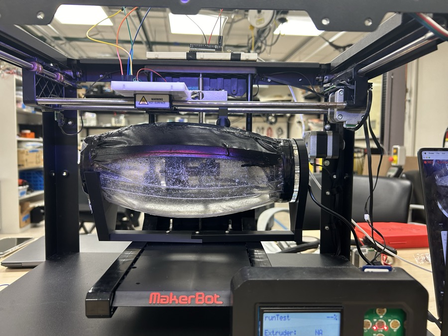
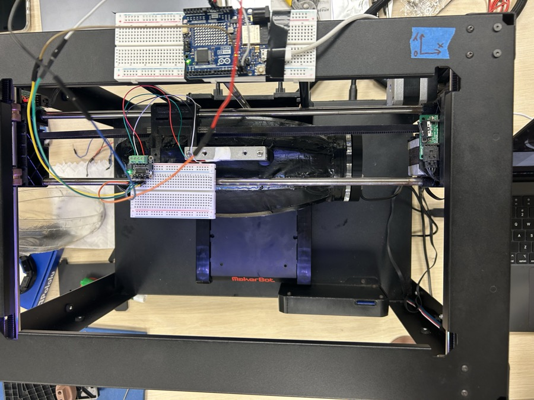
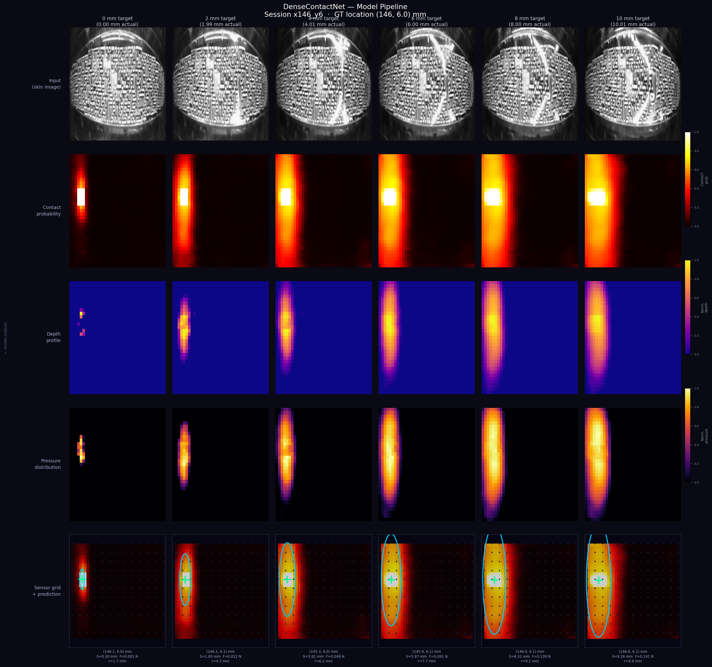
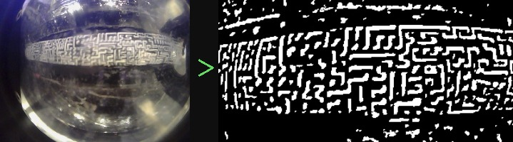
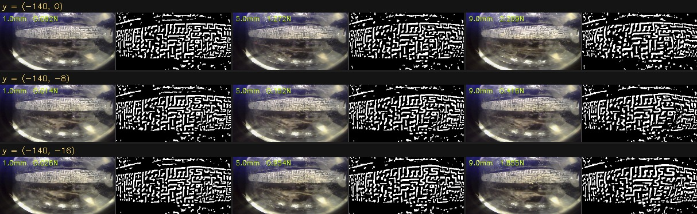
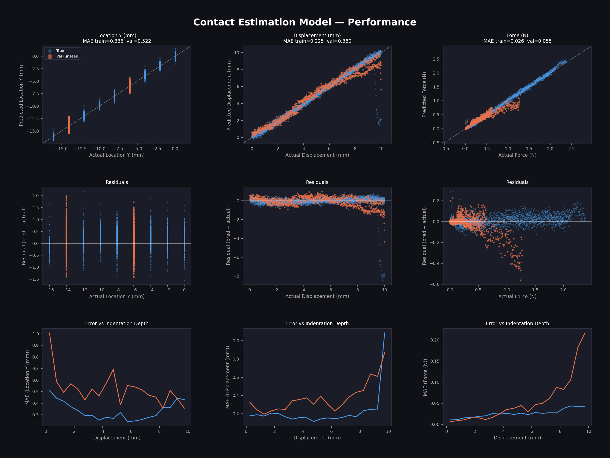
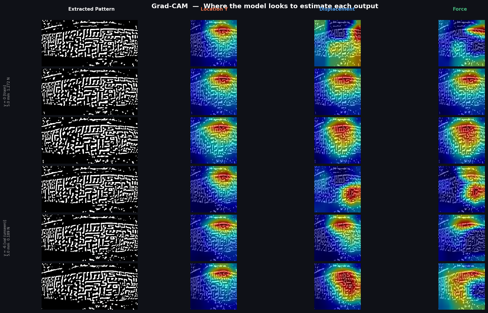
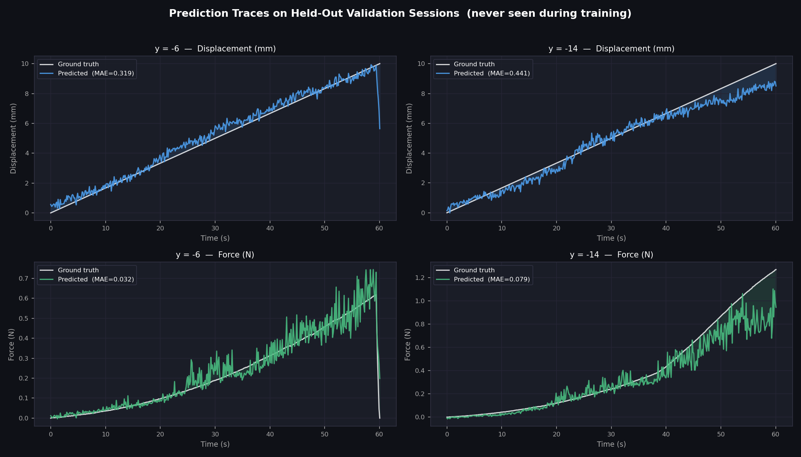
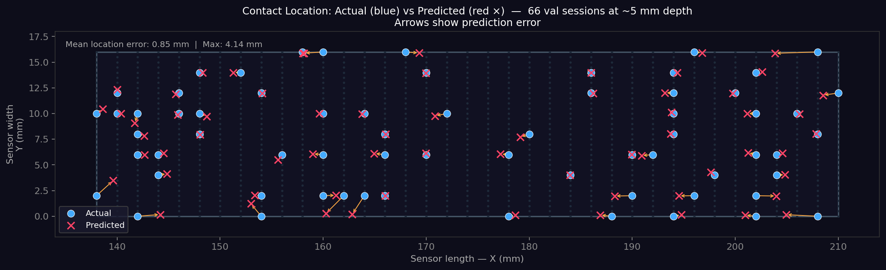
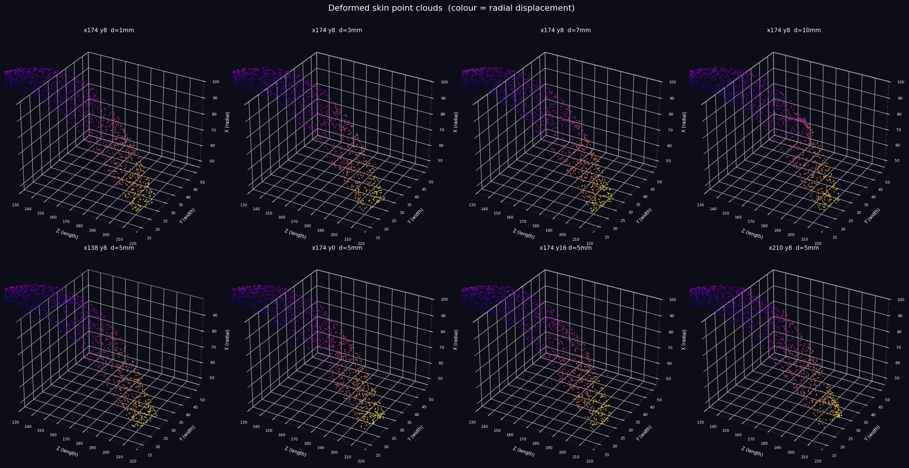

# Optical Tactile Sensing Research

A camera-based tactile sensing system that estimates **contact location, indentation depth, contact force, and full 3D skin deformation geometry** from visual deformation of a patterned elastomer skin — using only a USB camera and a load cell for ground truth.

---

## Hardware Setup

The system uses a **MakerBot 3D printer repurposed as a precision linear actuator** to indent a patterned tactile skin at controlled speed (10 mm/min) while recording synchronized camera and force data.

| | |
|---|---|
|  |  |
| *Front: tactile skin mounted in the actuator frame* | *Top: Arduino + NAU7802 load cell breakout* |

| Component | Details |
|---|---|
| Actuator | MakerBot 3D printer (repurposed linear stage) |
| Camera | USB 640×480 @ 30 fps, mounted looking at the skin underside |
| Load cell | SparkFun NAU7802 Qwiic Scale @ 40 SPS |
| MCU | Arduino (RedBoard Qwiic) — serial at 115200 baud |
| Skin | Patterned elastomer with printed dot array |

---

## Pipeline Overview



The research progresses through three increasingly rich representations of contact:

1. **Pattern extraction** — isolate the dot field from raw camera frames
2. **Contact estimation** — regress location, depth, and force from a single image (ResNet18)
3. **Dense contact estimation** — predict full spatial contact/depth/pressure maps (DenseContactNet)
4. **3D skin reconstruction** — predict the full deformed skin geometry as a point cloud (PointCloudNet)

---

## Step 1 — The Tactile Skin Pattern

The skin is a transparent elastomer with a **printed array of dots** on its surface. When an object contacts the skin, the dots deform — shifting, compressing, and spreading in a way that encodes the contact geometry and force.

The camera is mounted looking up at the underside of the skin through the transparent body, capturing the full dot field during indentation.

---

## Step 2 — Pattern Extraction

Raw camera frames contain lighting variation, reflections, and background clutter. A preprocessing pipeline isolates the dot pattern:

1. **CLAHE** — adaptive histogram equalization to normalize local contrast
2. **Adaptive thresholding** — detects dots brighter than their local neighborhood
3. **Global brightness floor** — rejects pixels below intensity 130 (eliminates dim noise)
4. **Morphological opening** — removes single-pixel noise while preserving dot structure



*Left: raw camera frame. Right: extracted binary dot pattern fed to the model.*

`preprocessing/live_extraction.py` runs this pipeline live from the camera, with an interactive ROI selector.

---

## Step 3 — Dataset Collection

Data is collected by pressing the actuator into the skin at **9 different y-positions** (0 to −16 mm in 2 mm steps) while recording synchronized camera frames + load cell force. Each press runs from 0 → 10 mm at 10 mm/min (60 seconds).

**Grid below:** each row = one contact location, each column = one indentation depth (1 mm / 5 mm / 9 mm). Left half of each cell = raw frame, right half = extracted pattern. Force and displacement labeled.



**Per session:** ~453 frames, 0–10 mm displacement, force ranging 0–2.4 N depending on contact position.

**CSV format per frame:**
```
time_s,  displacement_mm,  frame,  force_n,  image_path,  extracted_path
0.000,   0.0000,           0,      0.000,    frames/frame_00000.jpg,  frames/extracted/frame_00000.jpg
0.128,   0.0213,           1,      0.001,    frames/frame_00001.jpg,  frames/extracted/frame_00001.jpg
...
60.060,  10.010,           452,    1.847,    frames/frame_00452.jpg,  frames/extracted/frame_00452.jpg
```

**Total dataset:** 9 sessions × ~453 frames = **4,074 labeled frames**

| Session | y-position | Force range | Displacement |
|---|---|---|---|
| `(-140, 0)` | 0 mm | 0 – 2.38 N | 0 – 10 mm |
| `(-140, -2)` | −2 mm | 0 – 2.13 N | 0 – 10 mm |
| `(-140, -4)` | −4 mm | 0 – 1.52 N | 0 – 10 mm |
| `(-140, -6)` | −6 mm | 0 – 0.62 N | 0 – 10 mm |
| `(-140, -8)` | −8 mm | 0 – 0.50 N | 0 – 10 mm |
| `(-140, -10)` | −10 mm | 0 – 0.52 N | 0 – 10 mm |
| `(-140, -12)` | −12 mm | 0 – 0.56 N | 0 – 10 mm |
| `(-140, -14)` | −14 mm | 0 – 1.27 N | 0 – 10 mm |
| `(-140, -16)` | −16 mm | 0 – 2.02 N | 0 – 10 mm |

---

## Step 4 — Contact Estimation (ResNet18)

A **ResNet18** CNN is trained to regress four contact properties simultaneously from a single extracted pattern image.

```
Input: 224×224 extracted pattern (RGB)
         ↓
ResNet18 backbone (pretrained ImageNet, fine-tuned)
         ↓
Dropout(0.4) → Linear(512 → 128) → ReLU → Linear(128 → 4)
         ↓
Outputs: [ loc_x (mm),  loc_y (mm),  displacement (mm),  force (N) ]
```

**Training details:**
- **Loss**: L1 (MAE) on normalized outputs
- **Optimizer**: Adam with differential learning rates — backbone `1e-5`, head `1e-4`
- **Scheduler**: Cosine annealing
- **Augmentation**: horizontal/vertical flip, ±8° rotation
- **Validation**: Session-level holdout — y = −6 mm and y = −14 mm withheld entirely (unseen during training)
- **Early stopping**: patience = 25 epochs, stopped at epoch 131

**Val MAE on completely unseen contact locations:**

| Output | Train MAE | Val MAE (unseen locations) |
|---|---|---|
| Location Y | 0.34 mm | 0.52 mm |
| Displacement | 0.23 mm | 0.38 mm |
| Force | 0.026 N | 0.055 N |



*Top: predicted vs actual (blue = train sessions, orange = unseen val sessions). Middle: residuals. Bottom: MAE vs indentation depth.*

### Grad-CAM Attention

Grad-CAM reveals which regions of the dot pattern drive each output, across three indentation depths for a train session (y = 0) and a held-out val session (y = −6):



*Each row = one depth (1.5 / 5 / 9 mm). Columns: raw pattern | Location Y attention | Displacement attention | Force attention.*

### Prediction Traces on Held-Out Sessions



*White = ground truth, colored = model prediction. Shaded region = error. Full-press traces (0 → 10 mm) for both unseen val sessions.*

---

## Step 5 — Dense Contact Estimation (DenseContactNet)

Rather than predicting four scalar values, **DenseContactNet** predicts the full spatial distribution of contact across the sensor surface — producing three output maps and two scalar estimates simultaneously.

### Architecture

```
Input: (1, 224, 224) grayscale extracted pattern
         ↓
ResNet18 encoder (pretrained, fine-tuned at lr=1e-5)
         ↓
U-Net decoder with skip connections (4 decoder blocks, lr=1e-4)
         ↓
┌─ contact_map  : (33, 37)  contact probability [0, 1]
├─ depth_map    : (33, 37)  normalised indentation depth [0, 1]
├─ pressure_map : (33, 37)  normalised Hertz pressure [0, 1]
├─ loc_x        : scalar    contact X via soft-argmax (mm)
├─ loc_y        : scalar    contact Y via soft-argmax (mm)
├─ displacement : scalar    total indentation depth (normalised)
└─ force        : scalar    total force (normalised)
```

The sensor surface is sampled on a **33 × 37 grid** — 33 rows spanning 0–16 mm in Y, 37 columns spanning 138–210 mm in X (2 mm spacing).

### Supervision

Ground-truth maps are synthesized from scalar labels using physics-based models:
- **Contact map**: Gaussian blob centered at `(loc_x, loc_y)`, σ = indentor radius
- **Depth map**: Hertz contact profile — parabolic depth falloff within the contact patch
- **Pressure map**: Hertz pressure distribution — ellipsoidal profile ∝ √(1 − r²/a²)

### Loss

```
L = 1.0 × MSE(contact_map)
  + 1.0 × MSE(depth_map)
  + 1.0 × MSE(pressure_map)
  + 0.5 × L1(displacement)
  + 0.5 × L1(force)
  + 0.5 × L1(loc_x)
  + 2.0 × L1(loc_y)   ← higher weight: narrow 16mm Y range is harder
```

**Training:** 26,699 train frames / 6,598 val frames. Sessions y=6mm and y=14mm held out entirely.

**Visualisation tools:**
- `dense_contact/visualize_contact.py` — overlay predicted maps on images
- `dense_contact/visualize_model.py` — full model output dashboard
- `dense_contact/eval_grid.py` — per-position evaluation across the sensor grid



---

## Step 6 — 3D Skin Geometry (PointCloudNet)

**PointCloudNet** goes beyond contact maps and predicts the full **3D deformed geometry** of the tactile skin as a structured point cloud — enabling true spatial reconstruction of what the skin surface looks like during contact.

### Point Cloud Representation

Each frame is represented as a **(2048, 3)** array of `[X, Y, Z]` coordinates in mm, sampled on a fixed **32 × 64 structured grid** matching `dense_contact/rest_positions.npy`. Point ordering is consistent across all frames (point `k` always maps to grid cell `(k // 64, k % 64)`), which allows MSE training without nearest-neighbor matching.

### Ground Truth Generation

`reconstruction/generate_pointclouds.py` synthesizes point clouds from scalar labels using a physical skin deformation model:

- The skin at rest is a **spherical cap** (radius R₀ = 60 mm, half-angle 45°) approximating the real sensor geometry
- Under contact, skin points within the contact patch are displaced **vertically** by a Hertz deformation profile
- Off-center contacts hit the curved skin at an angle, naturally producing the correct asymmetric deformation

Output: `dense_contact/pointclouds/x{X}_y{Y}/frame_{N}.npy` — one `.npy` per frame, 2331 unique sessions.

### Architecture

```
Input: (1, 224, 224) grayscale extracted pattern
         ↓
ResNet18 encoder (pretrained)
         ↓
U-Net decoder (4 blocks with skip connections)
         ↓
PointCloud head: (B, C, H, W) → (B, 2048, 3)  — 3D coordinates in mm
         ↓
┌─ point_cloud : (2048, 3)  deformed skin geometry in mm
├─ displacement: scalar     total indentation (normalised)
└─ force       : scalar     total force (normalised)
```

### Loss

```
L = 1.0 × MSE(pred_cloud, target_cloud)   — geometry in mm²
  + 0.5 × L1(displacement)
  + 0.5 × L1(force)
```

**Training results (9 epochs before interruption):**

| Metric | Val (best) |
|---|---|
| Point cloud RMSE | 0.044 mm |
| Displacement MAE | 0.275 mm |
| Force MAE | 0.005 N |

`reconstruction/view_pointclouds.py` provides an interactive 3D viewer for inspecting point clouds by session and frame.



---

## Step 7 — Live Inference

`contact_estimation/live_predict.py` runs the ResNet18 model in real time from the live camera feed, overlaying predictions (location, displacement, force) on the video at 30 fps.

`dense_contact/infer_live.py` runs DenseContactNet live, rendering the predicted contact/depth/pressure maps in real time.

`dense_contact/infer_pointcloud_live.py` runs PointCloudNet live, rendering the predicted 3D skin deformation as an animated point cloud.

---

## Project Structure

```
TactileSensing/
├── assets/
│   ├── hardware/              # hardware_front.jpg, hardware_top.jpg
│   ├── figures/               # pipeline.png, contact_grid_map.png,
│   │                          #   comparison*.png, pattern_extraction.jpg,
│   │                          #   dataset_samples.jpg
│   └── plots/                 # force_vs_displacement_x*.png (10 sessions)
│
├── dataset/                   # Raw recordings (28 GB — not in git)
│   └── record.py              # Master recording: camera + load cell synchronized
│
├── preprocessing/
│   ├── live_extraction.py     # Live pattern extraction + interactive ROI selector
│   └── output/                # Demo videos
│
├── contact_estimation/        # Step 4: ResNet18 scalar estimator
│   ├── build_dataset.py       # Aggregate sessions → unified CSV
│   ├── train_model.py         # Train ResNet18 multi-output regressor
│   ├── live_predict.py        # Real-time inference from camera
│   ├── visualize.py           # Performance plots
│   ├── explain.py             # Grad-CAM + prediction trace figures
│   └── assets/                # gradcam.png, performance.png, prediction_traces.png
│
├── dense_contact/             # Steps 5 & 6: DenseContactNet + PointCloudNet
│   ├── dataset.py             # PyTorch dataset — images → maps + scalars
│   ├── model.py               # DenseContactNet + PointCloudNet architectures
│   ├── build_dataset.py       # Build dataset.csv from raw recordings
│   ├── build_images.py        # Run pattern extraction over all sessions
│   ├── build_rest_positions.py# Compute rest-state skin geometry
│   ├── build_synthetic.py     # Generate synthetic training data
│   ├── train.py               # Train DenseContactNet
│   ├── train_pointcloud.py    # Train PointCloudNet
│   ├── eval_grid.py           # Per-position evaluation grid
│   ├── infer_live.py          # Live DenseContactNet inference
│   ├── infer_pointcloud.py    # Point cloud inference on saved frames
│   ├── infer_pointcloud_live.py  # Live PointCloudNet inference
│   ├── visualize_contact.py   # Overlay contact maps on images
│   ├── visualize_model.py     # Full model output dashboard
│   ├── viz_half_radius.py     # Visualize half-radius contact profiles
│   ├── dataset.csv            # Master frame index (paths, labels)
│   ├── rest_positions.npy     # (2048, 3) undeformed skin geometry
│   ├── roi.json               # Camera region-of-interest definition
│   ├── model/                 # DenseContactNet weights
│   ├── model_pc/              # PointCloudNet weights
│   ├── images/                # Extracted pattern frames (15 GB — not in git)
│   ├── pointclouds/           # Ground-truth point clouds (66 MB)
│   ├── logs/                  # train.log, train_pc.log
│   └── assets/                # sample_raw.png, sample_extracted.png, etc.
│
├── reconstruction/            # Point cloud generation + visualisation
│   ├── generate_pointclouds.py  # Synthesize point clouds from dataset.csv
│   ├── view_pointclouds.py    # Interactive 3D point cloud viewer
│   ├── contact_sim.py         # Physical skin deformation model
│   ├── beam_deflection_profile_0.1.csv  # Deflection reference data
│   ├── pointclouds/           # Output .npy files (generated)
│   └── assets/                # pointcloud_preview.png, pointcloud_preview2.png
│
├── tools/                     # Standalone utilities
│   ├── camera_view.py         # Live camera feed viewer
│   ├── plot_force_displacement.py  # Force-displacement curve plotter
│   └── roi.json               # Root-level ROI definition
│
└── experiments/               # Archived earlier work
    ├── contraction_prediction/ # Earlier contraction classifier
    ├── displacement_test/      # Earlier single-output displacement model
    └── optical_flow/           # Optical flow motion analysis
```

---

## Quickstart

### Record a new session

```bash
python dataset/record.py
```

Streams camera + load cell simultaneously. Press `r` to start recording, `s` to stop. Output saved to `dataset/output/<session_name>/`.

### Build the dense contact dataset

```bash
# 1. Extract patterns from all raw recordings
python dense_contact/build_images.py

# 2. Build the master CSV (links images to force/displacement labels)
python dense_contact/build_dataset.py

# 3. Compute rest-state skin geometry
python dense_contact/build_rest_positions.py

# 4. Generate ground-truth point clouds
python reconstruction/generate_pointclouds.py
```

### Train

```bash
# DenseContactNet (contact/depth/pressure maps + scalars)
python dense_contact/train.py

# PointCloudNet (full 3D skin geometry)
python dense_contact/train_pointcloud.py
```

### Live inference

```bash
# Scalar contact estimator (ResNet18)
python contact_estimation/live_predict.py

# Dense map estimator (DenseContactNet)
python dense_contact/infer_live.py

# 3D geometry estimator (PointCloudNet)
python dense_contact/infer_pointcloud_live.py
```

---

## Dependencies

```bash
pip install opencv-python pyserial matplotlib torch torchvision pandas numpy pillow tqdm open3d
```

Requires Python 3.10+. Trained on Apple Silicon (MPS backend); CUDA works without code changes.

---

## Arduino Serial Format

The Arduino outputs 4 comma-separated fields at 115200 baud:

```
timestamp_us, raw_adc, weight_g, force_n
1234567, -42301, 12.34, 0.121
```

Send `t` over serial to re-tare.
