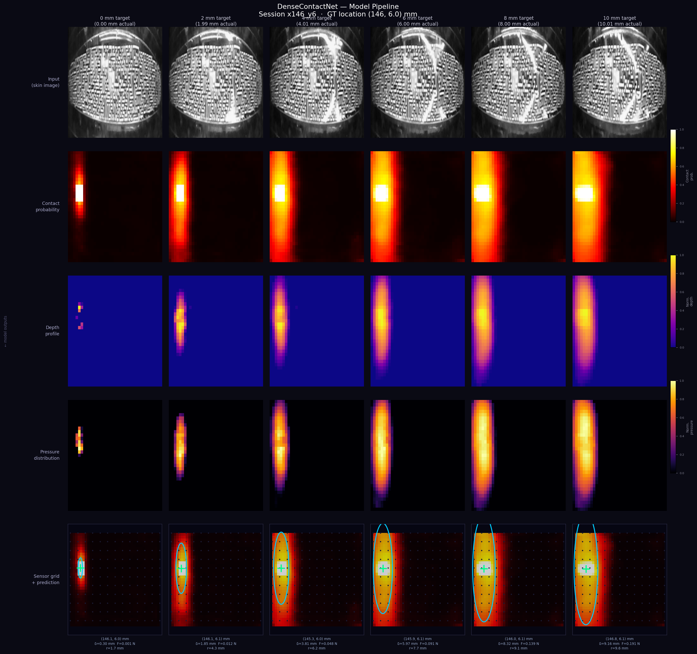
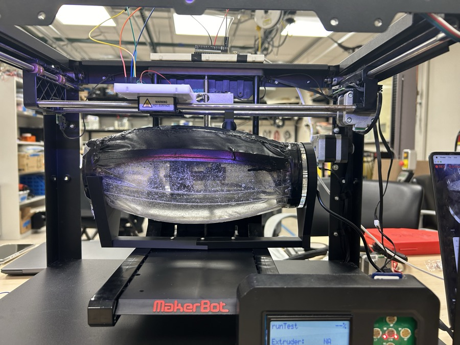
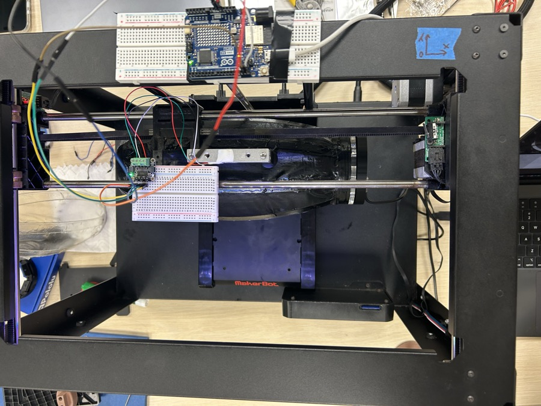
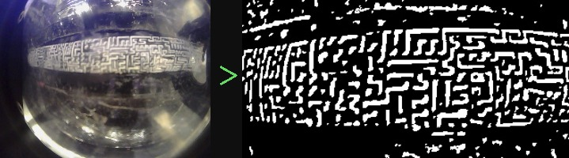
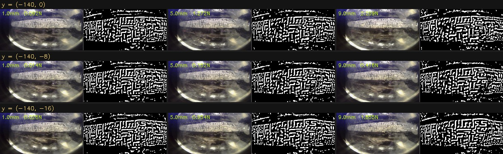
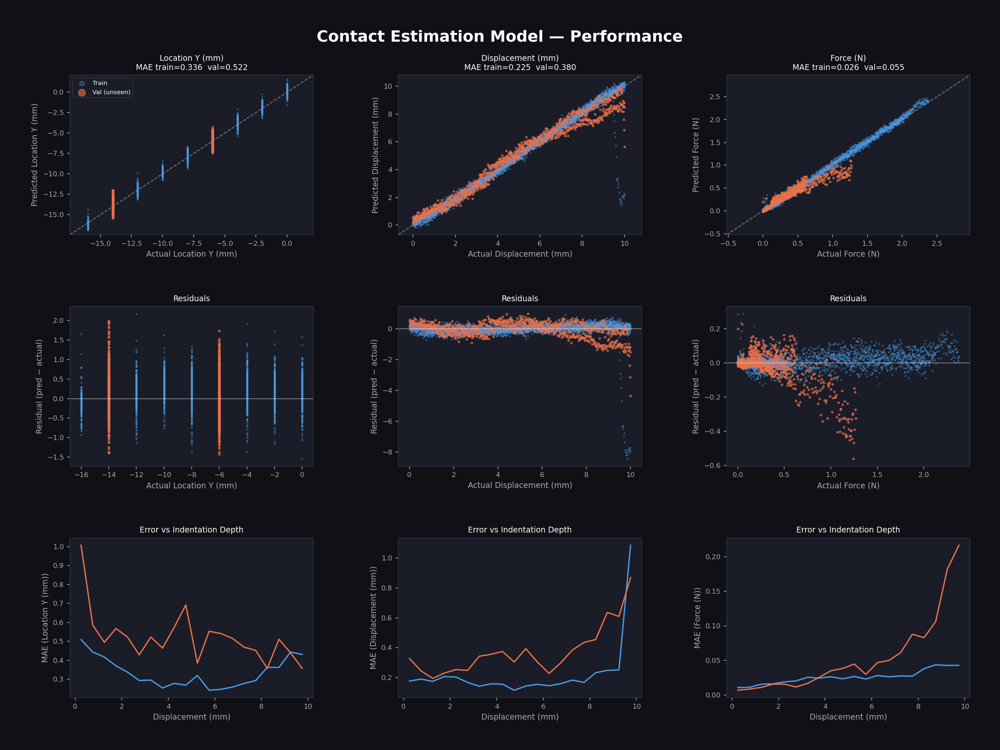
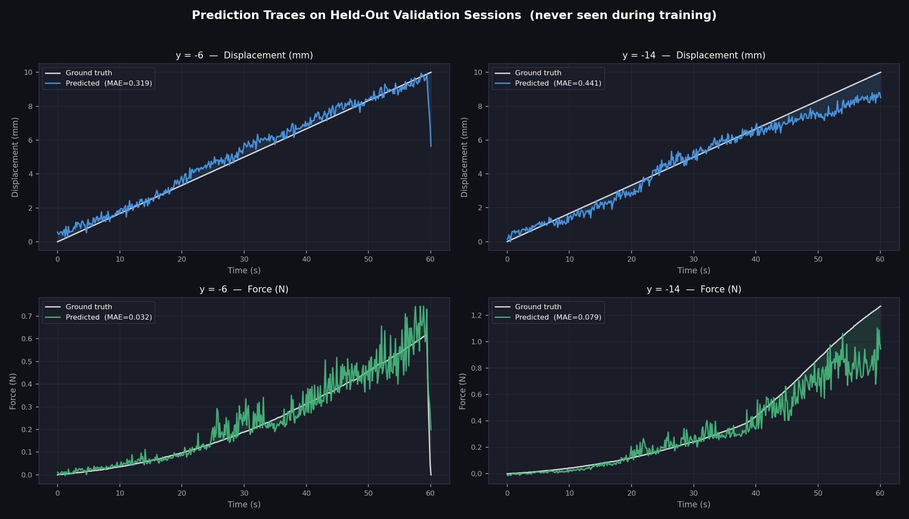
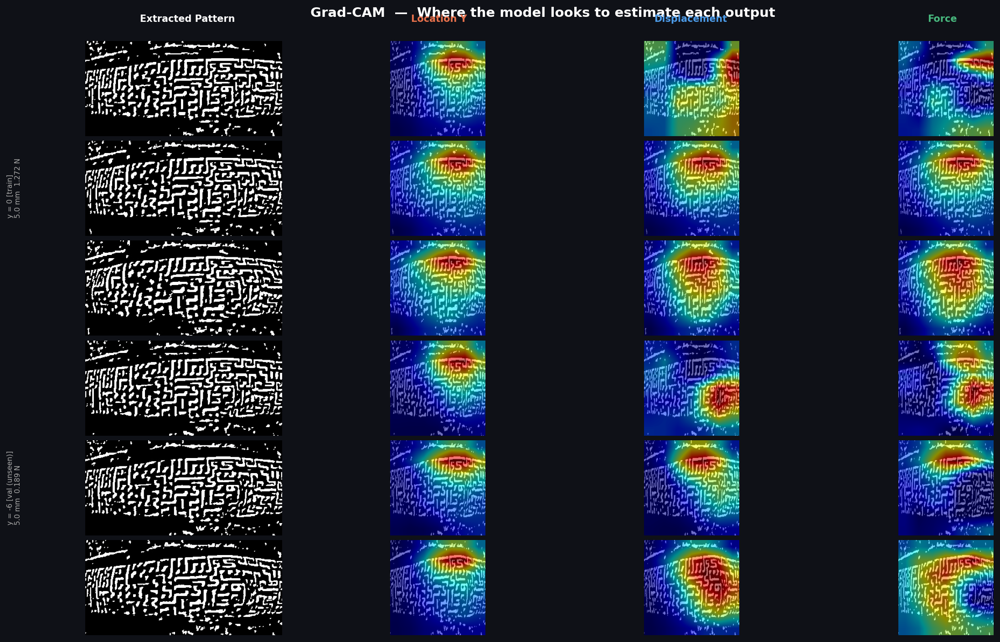
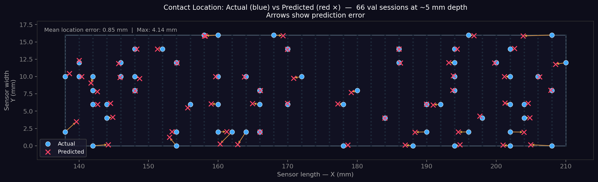
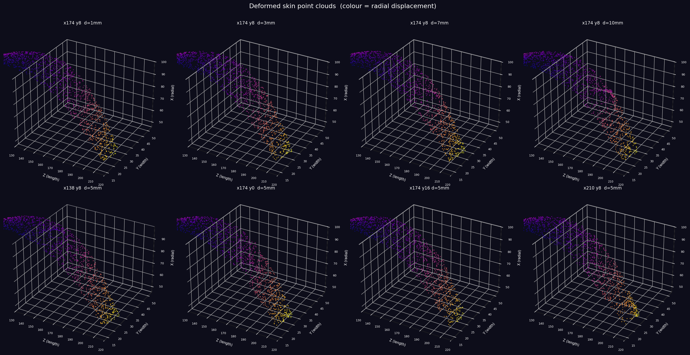

# Building a Camera-Based Tactile Sensor from Scratch: Dot Patterns, Hertzian Pseudo-Labels, and 3D Skin Reconstruction

*How I turned a webcam, a patterned elastomer, a $10 load cell, and a retired MakerBot into a tactile sensing system that localizes contact to half a millimeter, estimates force to a few millinewtons, and reconstructs the full 3D deformation of the skin — in real time, from a single grayscale image.*

---

Optical tactile sensors like GelSight and DIGIT are some of the coolest hardware in robotics: point a camera at a soft skin, and the image *is* the touch signal. But the established designs come with baggage — reflective membrane coatings, multi-directional structured illumination, photometric-stereo calibration, and ground-truth pipelines that need depth sensing of their own.

I wanted to know how far you can get with the absolute minimum: **one unmodified USB webcam looking at a dot-patterned transparent elastomer, supervised only by scalar measurements** — position, displacement, and force — that hobby-grade hardware can provide.

The answer turned out to be: surprisingly far. This post walks through the whole system — hardware, data collection, and three neural networks of increasing ambition:

1. **A ResNet18 regressor** that predicts contact location, indentation depth, and force from one image
2. **DenseContactNet**, a U-Net that predicts full spatial contact / depth / pressure maps — trained with *physics-generated pseudo-labels*, because I never collected dense ground truth
3. **PointCloudNet**, which predicts the entire deformed 3D geometry of the skin as a 2048-point cloud

Headline numbers, all on held-out data:

| Capability | Result |
|---|---|
| Contact localization (unseen locations, ResNet18) | **0.52 mm MAE** |
| Contact localization (DenseContactNet, X / Y) | **0.78 mm / 0.13 mm MAE** |
| Indentation depth | **0.29 mm MAE** |
| Contact force | **~5–6 mN MAE** |
| 3D skin reconstruction (vs. physics-model targets) | **0.044 mm per-point RMSE** |

All of it runs live at camera frame rate on a laptop.



---

## The Hardware: A 3D Printer Is Secretly a Precision Robot

The most expensive instrument in a tactile sensing project is usually the thing that generates ground truth. Commercial linear stages with encoder feedback cost thousands. But a consumer 3D printer is *already* a 3-axis positioning system with sub-millimeter repeatability — it just normally carries a hotend.

So I repurposed a MakerBot as the actuation platform. It positions a **10 mm spherical indentor** anywhere over the skin and presses down at a controlled **10 mm/min**, giving me commanded displacement as free ground truth.

| | |
|---|---|
|  |  |
| *The tactile skin mounted in the actuator frame* | *Arduino + NAU7802 load cell breakout* |

The full sensing stack:

| Component | Details |
|---|---|
| Actuator | MakerBot 3D printer, repurposed as a linear stage |
| Camera | USB, 640×480 @ 30 fps, looking up at the skin's underside |
| Load cell | SparkFun NAU7802 Qwiic Scale @ 40 SPS |
| MCU | Arduino (RedBoard Qwiic), serial @ 115200 baud |
| Skin | Transparent elastomer dome with a printed dot array |

The skin is the sensor. It's a transparent elastomer with an array of dots printed on its surface. When something presses into it, the dots shift, compress, and spread — and because the body is transparent, a camera underneath sees the entire deformation field. No coating, no LEDs, no photometric stereo. The dot displacement field *is* the signal.

Excluding the donor printer, the bill of materials is tens of dollars.

---

## Pattern Extraction: Classical CV Earns Its Keep

Raw frames are messy — glare, lighting gradients, background clutter. Rather than asking the network to learn invariance to all of that, a small classical pipeline strips it out up front:

1. **CLAHE** — adaptive histogram equalization to normalize local contrast
2. **Adaptive thresholding** — dots are detected as "brighter than their local neighborhood"
3. **Global brightness floor** — reject anything below intensity 130 to kill dim noise
4. **Morphological opening** — remove single-pixel speckle while preserving dot structure



*Left: raw camera frame. Right: the binary dot pattern the models actually see.*

This was one of the highest-leverage decisions in the project. Every model downstream consumes the extracted binary pattern (cropped to a fixed ROI, resized to 224×224), so illumination and background are non-issues *by construction* rather than something the network has to burn capacity on. `preprocessing/live_extraction.py` runs this live with an interactive ROI selector.

---

## The Dataset: 333 Presses, 150,675 Labeled Frames

Data collection is fully automated: the printer presses the indentor into the skin at a grid of positions while the camera and load cell record synchronized streams.

- **Grid**: X = 138–210 mm in 2 mm steps (37 columns) × Y = 0–16 mm in 0.5 mm steps (33 rows)
- **Per press**: 0 → 10 mm indentation at 10 mm/min, ~453 synchronized frames
- **Total**: **333 sessions, 150,675 frames**, each labeled with `(time, displacement, force, loc_x, loc_y)`



*Each row is a contact location; columns are 1 / 5 / 9 mm indentation depths. Left half of each cell: raw frame. Right half: extracted pattern.*

Every frame lands in a CSV like this:

```
time_s,  displacement_mm,  frame,  force_n,  image_path
0.000,   0.0000,           0,      0.000,    frames/frame_00000.jpg
0.128,   0.0213,           1,      0.001,    frames/frame_00001.jpg
...
60.060,  10.010,           452,    1.847,    frames/frame_00452.jpg
```

One interesting artifact of the curved skin: peak force varies strongly with contact position (roughly 0.1–0.45 N across the dense-training grid, up to ~2.4 N in earlier stiffer-configuration sessions), because the membrane's effective stiffness depends on where you poke it. The force–displacement curves in `assets/plots/` show this clearly — which is exactly why force can't just be read off displacement, and why the model has to actually look at the image.

---

## Model 1: ResNet18 Scalar Regression

The baseline question: can a plain CNN read contact state off a dot pattern?

```
Input: 224×224 extracted pattern (grayscale)
        ↓
ResNet18 backbone (ImageNet-pretrained; conv1 adapted to 1 channel
                   by averaging the pretrained RGB filters)
        ↓
Dropout(0.4) → Linear(512 → 128) → ReLU → Linear(128 → 4)
        ↓
[ loc_x (mm), loc_y (mm), displacement (mm), force (N) ]
```

Training details that mattered:

- **L1 loss** on outputs normalized to [0, 1] — L1 is noticeably more robust than MSE to the load cell's noise floor
- **Differential learning rates**: backbone at 1e-5 (gentle fine-tuning), head at 1e-4, with cosine annealing
- **Augmentation**: horizontal/vertical flips, ±8° rotation
- **Session-level holdout**: entire contact locations (y = −6 mm and y = −14 mm) withheld from training

That last point is the one I'd emphasize to anyone doing similar work. Frames within a press are heavily correlated — a random frame-level split will leak and give you flattering, meaningless validation numbers. Holding out *entire contact locations* means validation measures the question you actually care about: does the model generalize to places it has never been touched?

**Results on completely unseen contact locations:**

| Output | Train MAE | Val MAE (unseen locations) |
|---|---|---|
| Location Y | 0.34 mm | **0.52 mm** |
| Displacement | 0.23 mm | **0.38 mm** |
| Force | 0.026 N | **0.055 N** |



*Top: predicted vs. actual (blue = train sessions, orange = unseen val sessions). Middle: residuals. Bottom: MAE vs. indentation depth.*

Running the model over full held-out presses shows the predictions are temporally coherent even though inference is strictly single-frame — no recurrence, no filtering:



### What is the network actually looking at?

Grad-CAM on each output head:



*Rows: 1.5 / 5 / 9 mm depth, for a training session and a held-out one. Columns: input pattern, then attention for location-Y, displacement, and force.*

The localization head focuses tightly on the dot displacement around the contact site, while the force head integrates over a much broader region — which matches the physics: force is encoded in the *aggregate spread* of the dot field, not in any single dot.

---

## Model 2: DenseContactNet — Dense Maps Without Dense Labels

Four scalars is a thin description of contact. What I really wanted was *maps*: where is contact happening, how deep is the indentation at each point, what's the pressure distribution?

The problem: I had no dense ground truth. No depth camera, no photometric stereo, no tactile array under the skin. Only `(loc_x, loc_y, displacement, force)` per frame.

### The trick: Hertzian contact mechanics as a label generator

For a rigid sphere of radius *R* pressed depth *δ* into an elastic surface, classical Hertz theory gives closed forms for everything I need:

- **Contact patch radius**: `a = √(R·δ)`
- **Surface deformation profile**: `d(r) = δ · max(0, 1 − r²/a²)` — parabolic falloff inside the patch
- **Pressure distribution**: `p(r) = p₀ · √(1 − r²/a²)`, with peak pressure `p₀ = 3F / (2πa²)`

With *R* = 10 mm known, and *δ*, *F*, and the contact center measured per frame, I can evaluate these expressions on a grid and get **three dense supervision maps per frame, for free**. The contact-probability target is a Gaussian blob centered at the contact point with σ = *a*.

Are these labels exactly right? No — the skin is a curved, finite-thickness membrane, not an elastic half-space. But they encode the correct *structure*: compact support, monotone radial falloff, and force–area coupling. And crucially, their location and amplitude are anchored to measured quantities. It's physics-informed pseudo-labeling: the physics provides the shape prior, the measurements provide the anchor.

### Architecture

```
Input: (1, 224, 224) extracted pattern
        ↓
ResNet18 encoder (pretrained)        skips ┐
  56²×64 → 28²×128 → 14²×256 → 7²×512      │
        ↓                                  │
U-Net decoder (4 blocks) ◄─────────────────┘
        ↓  (64, 112, 112)
bilinear resample to the physical sensor grid (33 × 37)
        ↓
├─ contact_head  (1×1 conv → sigmoid) → contact probability map
├─ depth_head    (1×1 conv → ReLU)    → indentation depth map
├─ pressure_head (1×1 conv → ReLU)    → pressure map
├─ scalar head off the 7²×512 bottleneck → [displacement, force]
└─ soft-argmax (τ=10) over the contact map → (loc_x, loc_y) in mm
```

Two design details worth calling out:

- **The output grid is the physical sensor grid.** 33 rows × 37 columns corresponds exactly to the 0–16 mm × 138–210 mm measurement grid. Model outputs live directly in millimeters on the skin — no post-hoc calibration.
- **Localization via soft-argmax.** Instead of regressing (x, y) directly, location is computed as the probability-weighted average of grid coordinates under a temperature-scaled softmax of the contact map. This makes localization fully differentiable *through the map*, so the L1 location loss also shapes the contact map itself.

The loss is a weighted sum:

```
L = MSE(contact) + MSE(depth) + MSE(pressure)
  + 0.5·L1(displacement) + 0.5·L1(force)
  + 0.5·L1(loc_x) + 2.0·L1(loc_y)
```

Loc-Y gets 4× the weight of loc-X because the Y range (16 mm) is much narrower than X (72 mm) — without the upweighting the network happily ignores it.

### Training

- 80/20 **session-level** split scattered across the grid: 267 train / 66 val sessions → 26,699 / 6,598 frames
- **Depth-balanced sampling**: shallow indentations (δ < 3 mm) sampled at stride 2, deep ones at stride 10. Shallow contact is where localization is hardest (barely any dots move), so it should dominate the batch distribution
- Same optimizer recipe as before: Adam, differential LRs, cosine annealing

### Results

| Epoch | Val loss | Loc X MAE | Loc Y MAE | Disp MAE | Force MAE |
|---|---|---|---|---|---|
| 1 | 0.135 | 2.60 mm | 0.40 mm | 0.502 mm | 11.6 mN |
| 5 | 0.069 | 0.95 mm | 0.24 mm | 0.328 mm | 6.5 mN |
| **11** | **0.050** | **0.78 mm** | **0.13 mm** | **0.293 mm** | **6.1 mN** |

Force error dropped an order of magnitude versus the ResNet18 baseline (6.1 mN vs. 55 mN). Part of that is the much larger multi-position dataset, part is the spatial inductive bias — forcing the network to explain *where* the pressure is makes it better at saying *how much*.



*Per-position evaluation across the full 37×33 sensor grid — accuracy is spatially consistent across the 72×16 mm active area.*

---

## Model 3: PointCloudNet — Reconstructing the Skin in 3D

The final step: predict the entire deformed 3D shape of the skin from one image.

### The structured point cloud trick

Point cloud prediction usually drags in correspondence-free losses like Chamfer distance, which are slow and have ugly optimization landscapes. I sidestepped all of it with a structured representation:

- The skin is represented as a **fixed 32×64 grid = 2048 points**. Point *k* always corresponds to grid cell `(k // 64, k % 64)`, in every frame.
- The network predicts **per-point 3D offsets** (a 3-channel conv head with tanh, scaled to ±15 mm), added to a precomputed **rest-state geometry** — a 2048-point spherical cap (radius 60 mm, half-angle 45°) matching the physical dome.

Fixed correspondence means the geometry loss is just **plain per-point MSE in mm²**. No matching, no Chamfer, no problem. The network only has to learn the *deformation field*, not the shape from scratch — at zero indentation, predicting zero offsets already gives the right answer.

```
Input: (1, 224, 224) extracted pattern
        ↓
same ResNet18 encoder + U-Net decoder
        ↓  resample to (64, 32, 64)
Conv3×3 → BN → ReLU → Conv1×1(→3) → tanh → offsets × 15 mm
        ↓
rest_positions (2048, 3)  +  offsets  →  deformed cloud (2048, 3) in mm
        +
bottleneck scalar head → [displacement, force]
```

Target clouds are generated per frame by the same physics used for the dense maps: rest-cap points inside the Hertzian contact patch get displaced by the deformation profile. Off-center presses hit the curved dome at an angle and naturally produce asymmetric dimples.

### Results

| Epoch | Val loss | Cloud RMSE | Disp MAE | Force MAE |
|---|---|---|---|---|
| 1 | 0.073 | 0.159 mm | 0.504 mm | 11.0 mN |
| 5 | 0.029 | 0.062 mm | 0.324 mm | 6.9 mN |
| 8 | 0.023 | 0.052 mm | **0.275 mm** | **4.7 mN** |
| 9 | 0.023 | **0.044 mm** | 0.291 mm | 5.5 mN |

**0.044 mm per-point RMSE** — about 0.4% of the maximum 10 mm indentation — while simultaneously estimating displacement and force from the same forward pass.



*The reconstructed skin: the indentation dimple and surrounding membrane deformation, live from a single camera frame.*

And yes, it runs live: `dense_contact/infer_pointcloud_live.py` renders the deforming skin as an animated 3D point cloud while you poke the real one.

---

## Lessons Learned

**1. Spend your effort on supervision structure, not architecture.** Every model here is a bone-stock ResNet18, optionally with a textbook U-Net decoder. The interesting decisions were all about labels and evaluation: session-level holdout, Hertzian pseudo-labels, depth-balanced sampling, structured point correspondence, soft-argmax localization. Architecture novelty contributed nothing; supervision design contributed everything.

**2. Physics is a free label factory.** If you can measure a few scalars and you know the governing equations, you can synthesize dense supervision that would be impossibly expensive to measure. The network then learns the *inverse* mapping (image → physical state) from targets generated by the *forward* model.

**3. Classical CV as a front-end is undefeated.** The CLAHE + adaptive threshold extraction stage removed the entire nuisance-variation problem before learning started.

**4. Trust your validation split more than your loss curve.** Session-level holdout was the difference between numbers I believe and numbers I don't.

**5. Cheap hardware is closer than you think.** A retired 3D printer is a repeatable Cartesian robot. A $10 load cell at 40 SPS is a perfectly good force reference for quasi-static work.

## Limitations, honestly

- The dense maps and point clouds are supervised by **physics-generated pseudo-labels**, not independent 3D measurements. The 0.044 mm RMSE measures agreement with the Hertzian model, not with a laser scan of the real skin — validating against external depth sensing is the obvious next step.
- Everything uses a **single 10 mm spherical indentor**, pressed normally, one contact at a time. Shear, multi-contact, and arbitrary object geometry are untested.
- Training was cut short (PointCloudNet at epoch 9, DenseContactNet reported at epoch 11 of a 150-epoch schedule) with losses still falling — the reported numbers are likely conservative.
- One fabricated skin; robustness to fabrication variance and wear is unquantified.

## What's next

External 3D validation, richer contact geometries, the synthetic-data generator already sitting in the repo (`dense_contact/build_synthetic.py`) as a pretraining source, and — the real goal — closing the loop with actual manipulation.

---

*All code — hardware protocol, dataset tooling, training, evaluation, and the live demos — is in the repo. A preprint with full technical detail is on the way. Questions, ideas, or want to build one? Reach me at ahluwalia.ishan@gmail.com.*
